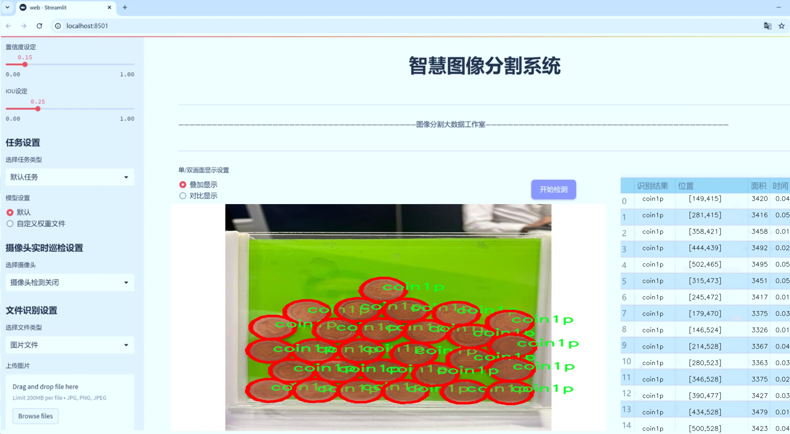
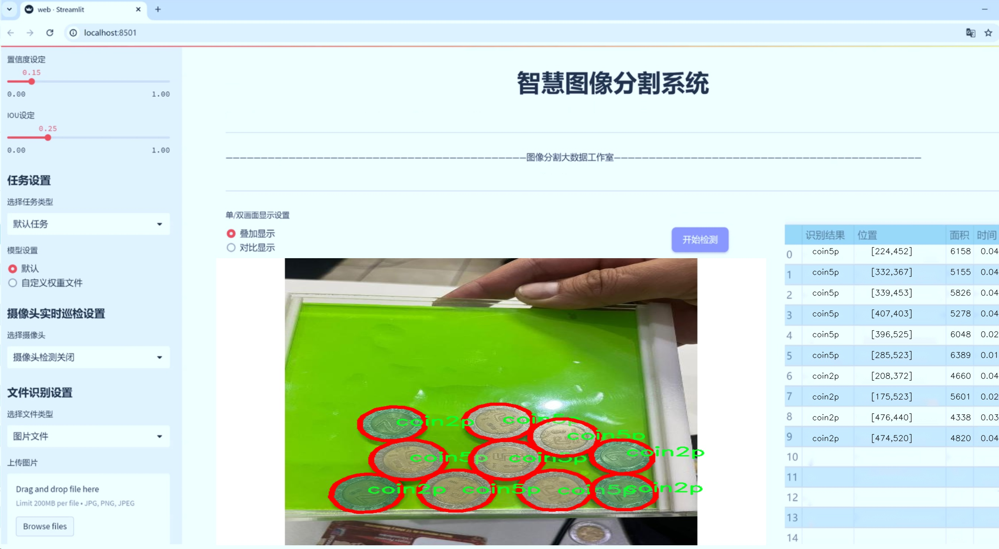
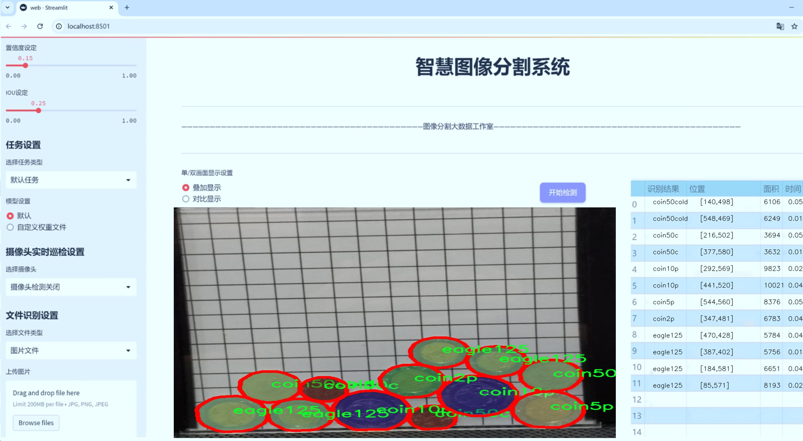
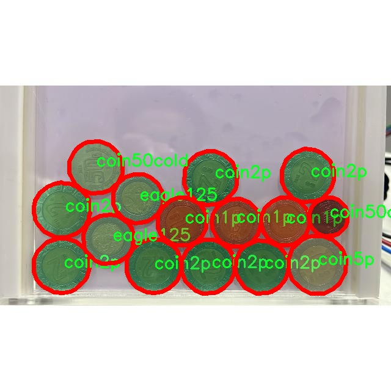
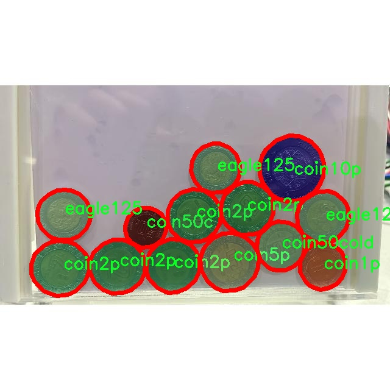
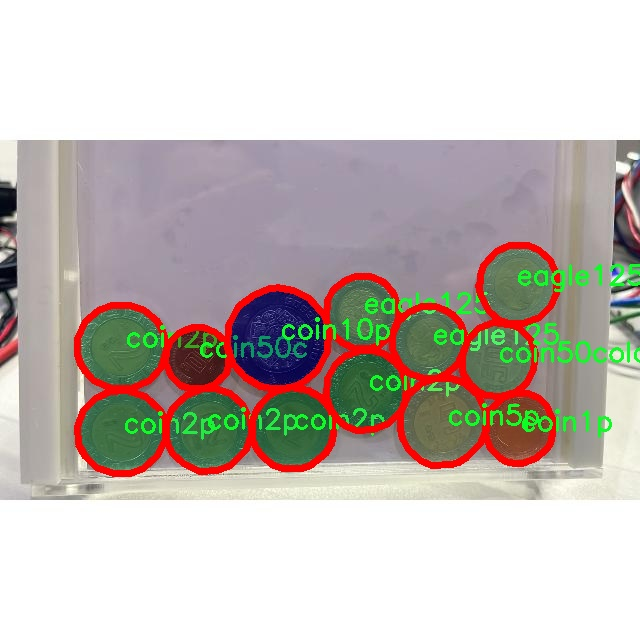

# 墨西哥硬币图像分割系统： yolov8-seg-fasternet-bifpn

### 1.研究背景与意义

[参考博客](https://gitee.com/YOLOv8_YOLOv11_Segmentation_Studio/projects)

[博客来源](https://kdocs.cn/l/cszuIiCKVNis)

研究背景与意义

随着全球经济的不断发展和数字化进程的加快，货币的使用方式和形态也在不断演变。在这一背景下，如何高效、准确地识别和分类各种货币，尤其是传统硬币，成为了计算机视觉和图像处理领域的重要研究课题。墨西哥作为拉丁美洲的重要经济体，其硬币种类繁多，涉及面广，因此，针对墨西哥硬币的图像分割和识别研究不仅具有理论价值，更具实际应用意义。

在现有的图像处理技术中，YOLO（You Only Look Once）系列模型因其高效的实时检测能力而受到广泛关注。YOLOv8作为该系列的最新版本，具备了更强的特征提取能力和更快的处理速度，能够在复杂环境中实现高精度的目标检测。然而，针对具体应用场景的模型改进仍然是提升性能的关键。基于YOLOv8的墨西哥硬币图像分割系统，旨在通过对模型的改进，增强其在硬币识别和分类任务中的表现，尤其是在处理不同光照、背景和角度变化时的鲁棒性。

本研究所使用的数据集“MXNCoins”包含2200张墨西哥硬币的图像，涵盖了8个不同的类别，包括10分、1分、2分、50分、50分旧币、5分硬币、默认类别和鹰125。这一数据集的多样性为模型的训练和测试提供了丰富的样本，有助于提高模型的泛化能力。通过对这些图像进行实例分割，不仅可以实现对硬币的精确定位，还可以为后续的自动化支付、智能货币识别等应用奠定基础。

在实际应用中，墨西哥硬币的自动识别系统可以广泛应用于零售、金融、博物馆和旅游等领域。例如，在零售行业，商家可以利用该系统快速识别顾客支付的硬币，提升结账效率；在博物馆，系统可以帮助游客更好地了解历史硬币的种类和背景；在旅游行业，系统可以为游客提供便捷的货币兑换服务。通过对墨西哥硬币的高效识别与分类，能够极大地提升用户体验和操作效率。

此外，本研究的成果还将为其他国家和地区的货币识别系统提供借鉴。随着全球化的推进，各国货币的识别与管理愈发重要。通过改进YOLOv8模型，研究者可以为不同国家的硬币图像分割任务提供有效的解决方案，推动计算机视觉技术在金融领域的应用发展。

综上所述，基于改进YOLOv8的墨西哥硬币图像分割系统的研究，不仅具有重要的学术价值，还具有广泛的应用前景。通过深入探索这一领域，能够为未来的货币识别技术提供新的思路和方法，推动相关技术的进步与创新。

### 2.图片演示







注意：本项目提供完整的训练源码数据集和训练教程,由于此博客编辑较早,暂不提供权重文件（best.pt）,需要按照6.训练教程进行训练后实现上图效果。

### 3.视频演示

[3.1 视频演示](https://www.bilibili.com/video/BV175zzY5EQ4/)

### 4.数据集信息

##### 4.1 数据集类别数＆类别名

nc: 8
names: ['coin10p', 'coin1p', 'coin2p', 'coin50c', 'coin50cold', 'coin5p', 'default', 'eagle125']


##### 4.2 数据集信息简介

数据集信息展示

在现代计算机视觉领域，图像分割技术的进步为物体识别和分类提供了新的可能性。为了推动这一领域的发展，我们构建了一个专门用于训练改进YOLOv8-seg的墨西哥硬币图像分割系统的数据集，命名为“MXNCoins”。该数据集不仅丰富了硬币图像的多样性，也为相关研究提供了重要的实验基础。

“MXNCoins”数据集包含了八个不同类别的墨西哥硬币，具体类别包括：coin10p、coin1p、coin2p、coin50c、coin50cold、coin5p、default和eagle125。这些类别涵盖了墨西哥流通中的主要硬币类型，具有广泛的代表性和实用性。每个类别的硬币在形状、颜色和尺寸上都有所不同，这为图像分割算法的训练提供了丰富的样本。通过对这些硬币进行精确的分割，系统能够更好地识别和分类不同面值的硬币，从而提升其在实际应用中的准确性和效率。

在数据集的构建过程中，我们注重数据的多样性和真实场景的模拟。每种硬币的图像均在不同的光照条件、背景和角度下拍摄，以确保模型能够在各种环境中表现出色。此外，数据集中还包含了一些背景复杂的图像，以测试模型在处理干扰信息时的鲁棒性。这种多样化的训练数据将有助于提高YOLOv8-seg模型在实际应用中的适应能力，确保其能够在真实世界中有效地识别和分割墨西哥硬币。

数据集的标注工作同样至关重要。我们采用了高精度的标注工具，对每一张图像中的硬币进行细致的分割标注，确保每个类别的边界清晰可辨。这种精确的标注不仅为模型的训练提供了高质量的输入数据，也为后续的模型评估和性能分析奠定了基础。通过对标注数据的严格管理，我们能够确保数据集的可靠性和有效性，使得研究人员在使用该数据集时能够获得真实的实验结果。

在模型训练过程中，MXNCoins数据集将作为核心数据源，帮助改进YOLOv8-seg的图像分割能力。通过对不同类别硬币的学习，模型将能够自动识别和分割出各种硬币的特征，进而实现高效的图像处理。这不仅能够提升硬币识别的准确性，还能为金融、零售等行业的自动化支付系统提供支持，推动相关技术的进步。

总之，MXNCoins数据集的构建为墨西哥硬币图像分割系统的研究提供了坚实的基础。通过对多样化硬币图像的收集与精确标注，我们期望该数据集能够为计算机视觉领域的研究者和开发者提供有价值的资源，推动图像分割技术的进一步发展与应用。随着技术的不断进步，我们相信，MXNCoins数据集将为未来的研究和应用开辟新的方向。









### 5.项目依赖环境部署教程（零基础手把手教学）

[5.1 环境部署教程链接（零基础手把手教学）](https://www.bilibili.com/video/BV1jG4Ve4E9t/?vd_source=bc9aec86d164b67a7004b996143742dc)


[5.2 安装Python虚拟环境创建和依赖库安装视频教程链接（零基础手把手教学）](https://www.bilibili.com/video/BV1nA4VeYEze/?vd_source=bc9aec86d164b67a7004b996143742dc)

### 6.手把手YOLOV8-seg训练视频教程（零基础手把手教学）

[6.1 手把手YOLOV8-seg训练视频教程（零基础小白有手就能学会）](https://www.bilibili.com/video/BV1cA4VeYETe/?vd_source=bc9aec86d164b67a7004b996143742dc)


按照上面的训练视频教程链接加载项目提供的数据集，运行train.py即可开始训练



     Epoch   gpu_mem       box       obj       cls    labels  img_size
     1/200     0G   0.01576   0.01955  0.007536        22      1280: 100%|██████████| 849/849 [14:42<00:00,  1.04s/it]
               Class     Images     Labels          P          R     mAP@.5 mAP@.5:.95: 100%|██████████| 213/213 [01:14<00:00,  2.87it/s]
                 all       3395      17314      0.994      0.957      0.0957      0.0843

     Epoch   gpu_mem       box       obj       cls    labels  img_size
     2/200     0G   0.01578   0.01923  0.007006        22      1280: 100%|██████████| 849/849 [14:44<00:00,  1.04s/it]
               Class     Images     Labels          P          R     mAP@.5 mAP@.5:.95: 100%|██████████| 213/213 [01:12<00:00,  2.95it/s]
                 all       3395      17314      0.996      0.956      0.0957      0.0845

     Epoch   gpu_mem       box       obj       cls    labels  img_size
     3/200     0G   0.01561    0.0191  0.006895        27      1280: 100%|██████████| 849/849 [10:56<00:00,  1.29it/s]
               Class     Images     Labels          P          R     mAP@.5 mAP@.5:.95: 100%|███████   | 187/213 [00:52<00:00,  4.04it/s]
                 all       3395      17314      0.996      0.957      0.0957      0.0845


### 7.50+种全套YOLOV8-seg创新点加载调参实验视频教程（一键加载写好的改进模型的配置文件）

[7.1 50+种全套YOLOV8-seg创新点加载调参实验视频教程（一键加载写好的改进模型的配置文件）](https://www.bilibili.com/video/BV1Hw4VePEXv/?vd_source=bc9aec86d164b67a7004b996143742dc)

### YOLOV8-seg算法简介

原始YOLOv8-seg算法原理

YOLOv8-seg算法是YOLO系列目标检测模型的最新迭代，结合了目标检测与实例分割的功能，旨在提供更高效、更精确的视觉理解能力。该算法的设计不仅基于YOLOv5的成功经验，还吸收了YOLOv6和YOLOX等前辈模型的优点，形成了一种全新的架构。YOLOv8-seg在精度和速度上均表现出色，适用于多种计算平台，从CPU到GPU都能高效运行。

YOLOv8-seg的网络结构主要由三个部分组成：输入端、主干网络和检测头。其核心在于引入了轻量化的C2F模块替代了传统的C3模块，C2F模块的设计充分考虑了计算效率与特征提取能力的平衡。C2F模块通过引入更多的残差连接，能够在保持轻量化的同时，增强梯度信息的传递，使得网络在训练过程中更加稳定，收敛速度更快。

在特征融合层，YOLOv8-seg采用了特征金字塔网络（FPN）与路径聚合网络（PAN）的结合，形成了一种高效的特征融合机制。FPN能够有效地处理不同尺度的特征信息，而PAN则进一步优化了特征的传递路径，确保了多层次特征的有效利用。为了进一步提升特征提取的速度，YOLOv8-seg还引入了BiFPN网络，采用双向跨尺度连接和加权特征融合的策略，确保模型能够在不同尺度的特征中快速提取关键信息。

YOLOv8-seg的检测头部分采用了解耦合头结构，这一创新使得分类和回归任务可以独立进行，极大地提高了模型的灵活性和准确性。传统的锚框机制被抛弃，取而代之的是Anchor-Free的检测策略，这一转变不仅简化了模型的设计，还提高了对小目标的检测能力。此外，YOLOv8-seg在损失函数的设计上也进行了创新，采用了BCELoss作为分类损失，DFLLoss与CIoULoss作为回归损失，这种组合能够更好地优化模型的学习过程。

在训练过程中，YOLOv8-seg引入了动态的样本分配策略，通过关闭马赛克增强等技术手段，确保模型在不同阶段都能获得最佳的训练效果。这种灵活的训练策略使得YOLOv8-seg在面对复杂场景时，能够保持高效的学习能力。

YOLOv8-seg不仅在目标检测方面表现优异，其在实例分割任务中的能力同样不可小觑。通过对特征图的精细处理，YOLOv8-seg能够在像素级别上进行目标分割，为后续的图像分析提供了丰富的信息。这一特性使得YOLOv8-seg在自动驾驶、智能监控、医疗影像等领域具有广泛的应用前景。

总的来说，YOLOv8-seg算法的设计充分体现了现代计算机视觉领域对高效性和准确性的追求。通过引入轻量化的网络结构、创新的特征融合方法和灵活的训练策略，YOLOv8-seg不仅在性能上超越了前代模型，更为未来的研究与应用提供了新的思路和方向。随着YOLOv8-seg的不断发展与完善，预计其将在更多实际应用中展现出强大的能力，推动计算机视觉技术的进一步进步。


### 9.系统功能展示（检测对象为举例，实际内容以本项目数据集为准）

图9.1.系统支持检测结果表格显示

  图9.2.系统支持置信度和IOU阈值手动调节

  图9.3.系统支持自定义加载权重文件best.pt(需要你通过步骤5中训练获得)

  图9.4.系统支持摄像头实时识别

  图9.5.系统支持图片识别

  图9.6.系统支持视频识别

  图9.7.系统支持识别结果文件自动保存

  图9.8.系统支持Excel导出检测结果数据


### 10.50+种全套YOLOV8-seg创新点原理讲解（非科班也可以轻松写刊发刊，V11版本正在科研待更新）

#### 10.1 由于篇幅限制，每个创新点的具体原理讲解就不一一展开，具体见下列网址中的创新点对应子项目的技术原理博客网址【Blog】：


[10.1 50+种全套YOLOV8-seg创新点原理讲解链接](https://gitee.com/qunmasj/good)

#### 10.2 部分改进模块原理讲解(完整的改进原理见上图和技术博客链接)【如果此小节的图加载失败可以通过CSDN或者Github搜索该博客的标题访问原始博客，原始博客图片显示正常】
### CBAM空间注意力机制
近年来，随着深度学习研究方向的火热，注意力机制也被广泛地应用在图像识别、语音识别和自然语言处理等领域，注意力机制在深度学习任务中发挥着举足轻重的作用。注意力机制借鉴于人类的视觉系统，例如，人眼在看到一幅画面时，会倾向于关注画面中的重要信息，而忽略其他可见的信息。深度学习中的注意力机制和人类视觉的注意力机制相似，通过扫描全局数据，从大量数据中选择出需要重点关注的、对当前任务更为重要的信息，然后对这部分信息分配更多的注意力资源，从这些信息中获取更多所需要的细节信息，而抑制其他无用的信息。而在深度学习中，则具体表现为给感兴趣的区域更高的权重，经过网络的学习和调整，得到最优的权重分配，形成网络模型的注意力，使网络拥有更强的学习能力，加快网络的收敛速度。
注意力机制通常可分为软注意力机制和硬注意力机制[4-5]。软注意力机制在选择信息时，不是从输入的信息中只选择1个，而会用到所有输入信息，只是各个信息对应的权重分配不同，然后输入网络模型进行计算;硬注意力机制则是从输入的信息中随机选取一个或者选择概率最高的信息，但是这一步骤通常是不可微的，导致硬注意力机制更难训练。因此，软注意力机制应用更为广泛，按照原理可将软注意力机制划分为:通道注意力机制（channel attention)、空间注意力机制(spatial attention）和混合域注意力机制(mixed attention)。
通道注意力机制的本质建立各个特征通道之间的重要程度，对感兴趣的通道进行重点关注，弱化不感兴趣的通道的作用;空间注意力的本质则是建模了整个空间信息的重要程度，然后对空间内感兴趣的区域进行重点关注，弱化其余非感兴趣区域的作用;混合注意力同时运用了通道注意力和空间注意力，两部分先后进行或并行，形成对通道特征和空间特征同时关注的注意力模型。

卷积层注意力模块(Convolutional Block Attention Module，CBAM）是比较常用的混合注意力模块，其先后集中了通道注意力模块和空间注意力模块，网络中加入该模块能有效提高网络性能，减少网络模型的计算量，模块结构如图所示。输入特征图首先经过分支的通道注意力模块，然后和主干的原特征图融合，得到具有通道注意力的特征图，接着经过分支的空间注意力模块，在和主干的特征图融合后，得到同时具有通道特征注意力和空间特征注意力的特征图。CBAM模块不改变输入特征图的大小，因此该模块是一个“即插即用”的模块，可以插入网络的任何位置。

通道注意力模块的结构示意图如图所示，通道注意力模块分支并行地对输入的特征图进行最大池化操作和平均池化操作，然后利用多层感知机对结果进行变换，得到应用于两个通道的变换结果，最后经过sigmoid激活函数将变换结果融合，得到具有通道注意力的通道特征图。

空间注意力模块示意图如图所示，将通道注意力模块输出的特征图作为该模块的输入特征图，首先对输入特征图进行基于通道的最大池化操作和平均池化操作，将两部分得到的结果拼接起来，然后通过卷积得到降为Ⅰ通道的特征图，最后通过sigmoid激活函数生成具有空间注意力的特征图。


### 11.项目核心源码讲解（再也不用担心看不懂代码逻辑）

#### 11.1 ultralytics\utils\dist.py

以下是对代码的逐文件分析，保留了最核心的部分，并进行了详细的中文注释：

```python
# Ultralytics YOLO 🚀, AGPL-3.0 license

import os
import re
import shutil
import socket
import sys
import tempfile
from pathlib import Path

from . import USER_CONFIG_DIR
from .torch_utils import TORCH_1_9

def find_free_network_port() -> int:
    """
    查找本地主机上可用的端口。

    在单节点训练时很有用，因为我们不想连接到真实的主节点，但必须设置
    `MASTER_PORT` 环境变量。
    """
    with socket.socket(socket.AF_INET, socket.SOCK_STREAM) as s:
        s.bind(('127.0.0.1', 0))  # 绑定到本地地址和随机端口
        return s.getsockname()[1]  # 返回分配的端口号

def generate_ddp_file(trainer):
    """生成 DDP 文件并返回其文件名。"""
    # 获取训练器的模块和类名
    module, name = f'{trainer.__class__.__module__}.{trainer.__class__.__name__}'.rsplit('.', 1)

    # 创建 DDP 文件的内容
    content = f'''overrides = {vars(trainer.args)} \nif __name__ == "__main__":
    from {module} import {name}
    from ultralytics.utils import DEFAULT_CFG_DICT

    cfg = DEFAULT_CFG_DICT.copy()
    cfg.update(save_dir='')   # 处理额外的键 'save_dir'
    trainer = {name}(cfg=cfg, overrides=overrides)
    trainer.train()'''
    
    # 创建 DDP 目录（如果不存在）
    (USER_CONFIG_DIR / 'DDP').mkdir(exist_ok=True)
    
    # 创建临时文件并写入内容
    with tempfile.NamedTemporaryFile(prefix='_temp_',
                                     suffix=f'{id(trainer)}.py',
                                     mode='w+',
                                     encoding='utf-8',
                                     dir=USER_CONFIG_DIR / 'DDP',
                                     delete=False) as file:
        file.write(content)  # 写入内容到临时文件
    return file.name  # 返回临时文件的名称

def generate_ddp_command(world_size, trainer):
    """生成并返回分布式训练的命令。"""
    import __main__  # 本地导入以避免特定问题
    if not trainer.resume:
        shutil.rmtree(trainer.save_dir)  # 删除保存目录
    file = str(Path(sys.argv[0]).resolve())  # 获取当前脚本的绝对路径
    safe_pattern = re.compile(r'^[a-zA-Z0-9_. /\\-]{1,128}$')  # 允许的字符和最大长度限制
    # 检查文件名是否安全且存在，并且以 .py 结尾
    if not (safe_pattern.match(file) and Path(file).exists() and file.endswith('.py')):
        file = generate_ddp_file(trainer)  # 生成 DDP 文件
    dist_cmd = 'torch.distributed.run' if TORCH_1_9 else 'torch.distributed.launch'  # 根据 PyTorch 版本选择命令
    port = find_free_network_port()  # 查找可用端口
    # 构建命令列表
    cmd = [sys.executable, '-m', dist_cmd, '--nproc_per_node', f'{world_size}', '--master_port', f'{port}', file]
    return cmd, file  # 返回命令和文件名

def ddp_cleanup(trainer, file):
    """如果创建了临时文件，则删除它。"""
    if f'{id(trainer)}.py' in file:  # 检查文件名中是否包含临时文件后缀
        os.remove(file)  # 删除临时文件
```

### 代码核心部分说明：
1. **查找可用端口**：`find_free_network_port` 函数用于查找本地主机上可用的网络端口，适用于分布式训练时设置 `MASTER_PORT` 环境变量。
  
2. **生成 DDP 文件**：`generate_ddp_file` 函数生成一个用于分布式数据并行（DDP）训练的 Python 文件，包含训练器的配置和训练逻辑。

3. **生成分布式训练命令**：`generate_ddp_command` 函数构建并返回用于启动分布式训练的命令，包括处理文件路径和选择合适的分布式命令。

4. **清理临时文件**：`ddp_cleanup` 函数用于删除在训练过程中生成的临时文件，以避免文件系统中的冗余文件。

这个文件是Ultralytics YOLO项目中的一个模块，主要用于处理分布式训练相关的功能。代码中定义了一些函数，以支持在多节点环境下进行模型训练。

首先，`find_free_network_port`函数用于查找本地主机上一个可用的网络端口。它通过创建一个TCP套接字并绑定到地址127.0.0.1的随机端口来实现这一点。这个功能在单节点训练时非常有用，因为我们不需要连接到真实的主节点，但仍然需要设置`MASTER_PORT`环境变量。

接下来，`generate_ddp_file`函数用于生成一个分布式数据并行（DDP）训练的Python文件，并返回该文件的名称。它首先获取传入的训练器对象的模块和类名，然后构建一个包含训练参数的Python脚本内容。这个脚本会在主程序中被执行，以便进行训练。生成的文件会被保存在用户配置目录下的`DDP`文件夹中，确保该文件夹存在。如果该文件夹不存在，代码会自动创建它。生成的文件名是基于训练器对象的ID，以避免命名冲突。

然后，`generate_ddp_command`函数用于生成并返回一个用于分布式训练的命令。它首先检查训练器是否需要恢复训练，如果不需要，则删除保存目录。接着，它会检查当前执行的文件是否符合安全模式（即文件名只包含允许的字符且存在且以.py结尾）。如果不符合条件，则调用`generate_ddp_file`生成一个临时文件。接下来，函数会确定使用的分布式命令（根据PyTorch版本选择不同的命令），并调用`find_free_network_port`获取一个可用的端口。最终，函数返回一个包含命令和文件名的列表。

最后，`ddp_cleanup`函数用于清理临时文件。如果在生成的文件名中包含训练器的ID，则会删除该临时文件。这是为了确保在训练完成后不会留下不必要的临时文件。

总体而言，这个模块的功能是支持Ultralytics YOLO在分布式环境下的训练，通过生成必要的配置文件和命令来简化用户的操作。

#### 11.2 ultralytics\engine\validator.py

以下是经过简化和注释的核心代码部分，主要集中在模型验证的逻辑上：

```python
import json
import time
import torch
from ultralytics.utils import LOGGER, TQDM
from ultralytics.utils.torch_utils import select_device, smart_inference_mode

class BaseValidator:
    """
    BaseValidator类用于创建验证器的基类。
    该类负责模型的验证过程，包括数据加载、推理、损失计算和结果输出等。
    """

    def __init__(self, dataloader=None, save_dir=None, args=None):
        """
        初始化BaseValidator实例。

        Args:
            dataloader (torch.utils.data.DataLoader): 用于验证的数据加载器。
            save_dir (Path, optional): 保存结果的目录。
            args (SimpleNamespace): 验证器的配置参数。
        """
        self.args = args  # 保存配置参数
        self.dataloader = dataloader  # 数据加载器
        self.save_dir = save_dir  # 保存结果的目录
        self.model = None  # 模型
        self.device = None  # 设备（CPU或GPU）
        self.jdict = []  # 用于存储JSON格式的验证结果

    @smart_inference_mode()
    def __call__(self, model):
        """
        支持对预训练模型的验证。
        Args:
            model (nn.Module): 要验证的模型。
        """
        self.device = select_device(self.args.device)  # 选择设备
        self.model = model.to(self.device)  # 将模型移动到指定设备
        self.model.eval()  # 设置模型为评估模式

        bar = TQDM(self.dataloader, desc='Validating', total=len(self.dataloader))  # 创建进度条
        for batch_i, batch in enumerate(bar):
            # 预处理
            batch = self.preprocess(batch)

            # 推理
            preds = self.model(batch['img'].to(self.device))  # 将图像移动到设备并进行推理

            # 后处理
            preds = self.postprocess(preds)

            # 更新指标
            self.update_metrics(preds, batch)

            # 记录结果
            self.jdict.append(preds.cpu().numpy().tolist())  # 将预测结果添加到jdict中

        # 保存结果
        if self.args.save_json:
            with open(str(self.save_dir / 'predictions.json'), 'w') as f:
                json.dump(self.jdict, f)  # 保存为JSON格式
                LOGGER.info(f'Saved predictions to {f.name}')

    def preprocess(self, batch):
        """对输入批次进行预处理。"""
        return batch  # 这里可以添加实际的预处理逻辑

    def postprocess(self, preds):
        """对模型的预测结果进行后处理。"""
        return preds  # 这里可以添加实际的后处理逻辑

    def update_metrics(self, preds, batch):
        """根据预测结果和批次更新指标。"""
        pass  # 这里可以添加更新指标的逻辑
```

### 代码说明：
1. **BaseValidator类**：这是一个基类，用于处理模型验证的主要逻辑。
2. **`__init__`方法**：初始化验证器的基本参数，包括数据加载器、保存目录和配置参数。
3. **`__call__`方法**：该方法执行验证过程，包括数据的预处理、模型推理、后处理和结果记录。
4. **`preprocess`和`postprocess`方法**：这两个方法用于处理输入数据和模型输出，当前实现是占位符，可以根据需要进行扩展。
5. **`update_metrics`方法**：用于更新模型性能指标，当前实现为空，可以根据需求添加具体逻辑。
6. **结果保存**：在验证结束后，将预测结果保存为JSON格式。

以上代码展示了如何构建一个基本的模型验证框架，并提供了清晰的注释以帮助理解每个部分的功能。

这个程序文件是Ultralytics YOLO（You Only Look Once）框架中的一个验证器模块，主要用于评估模型在测试集或验证集上的准确性。程序的开头包含了使用说明，展示了如何通过命令行运行验证，包括支持的模型格式。

文件中定义了一个名为`BaseValidator`的类，这是一个用于创建验证器的基类。该类包含多个属性和方法，负责模型验证的各个环节。属性包括配置参数、数据加载器、模型、设备信息、当前批次索引、训练状态、类别名称、统计信息、混淆矩阵、IoU阈值等。构造函数`__init__`初始化这些属性，并设置保存结果的目录。

类中的`__call__`方法是验证的核心，支持对预训练模型或正在训练的模型进行验证。根据传入的参数，方法会选择合适的模型和设备，并准备数据集。然后，它会初始化进度条，记录时间性能，并在每个批次上执行预处理、推理、损失计算和后处理等步骤。验证过程中还会更新性能指标，并在必要时绘制验证样本和预测结果。

此外，类中定义了一些辅助方法，例如`match_predictions`用于将预测结果与真实标签进行匹配，`add_callback`和`run_callbacks`用于管理和执行回调函数，`get_dataloader`和`build_dataset`用于获取数据加载器和构建数据集（这两个方法在基类中未实现，需要在子类中实现）。

`preprocess`和`postprocess`方法用于处理输入批次和输出预测，`init_metrics`、`update_metrics`、`finalize_metrics`等方法用于初始化和更新性能指标。`get_stats`和`check_stats`方法用于获取和检查模型性能统计信息，`print_results`用于打印结果。

最后，类中还定义了一些用于绘图和结果评估的辅助方法，例如`plot_val_samples`和`plot_predictions`，以及将预测结果转换为JSON格式的`pred_to_json`和评估JSON格式统计的`eval_json`。

整体来看，这个文件是YOLO模型验证过程的核心组成部分，负责处理模型的验证逻辑、性能评估和结果输出。

#### 11.3 ultralytics\data\dataset.py

以下是代码中最核心的部分，并附上详细的中文注释：

```python
class YOLODataset(BaseDataset):
    """
    YOLO数据集类，用于加载YOLO格式的目标检测和/或分割标签。

    参数:
        data (dict, optional): 数据集的YAML字典。默认为None。
        use_segments (bool, optional): 如果为True，则使用分割掩码作为标签。默认为False。
        use_keypoints (bool, optional): 如果为True，则使用关键点作为标签。默认为False。

    返回:
        (torch.utils.data.Dataset): 可用于训练目标检测模型的PyTorch数据集对象。
    """

    def __init__(self, *args, data=None, use_segments=False, use_keypoints=False, **kwargs):
        """初始化YOLODataset，配置分割和关键点的可选设置。"""
        self.use_segments = use_segments  # 是否使用分割掩码
        self.use_keypoints = use_keypoints  # 是否使用关键点
        self.data = data  # 数据集的YAML字典
        assert not (self.use_segments and self.use_keypoints), '不能同时使用分割和关键点。'  # 确保不能同时使用分割和关键点
        super().__init__(*args, **kwargs)  # 调用父类的初始化方法

    def cache_labels(self, path=Path('./labels.cache')):
        """
        缓存数据集标签，检查图像并读取形状。

        参数:
            path (Path): 保存缓存文件的路径（默认: Path('./labels.cache')）。
        返回:
            (dict): 标签字典。
        """
        x = {'labels': []}  # 初始化标签字典
        nm, nf, ne, nc, msgs = 0, 0, 0, 0, []  # 统计缺失、找到、空、损坏的图像数量和消息
        total = len(self.im_files)  # 总图像数量
        nkpt, ndim = self.data.get('kpt_shape', (0, 0))  # 获取关键点形状

        # 检查关键点形状是否有效
        if self.use_keypoints and (nkpt <= 0 or ndim not in (2, 3)):
            raise ValueError("'kpt_shape'在data.yaml中缺失或不正确。应该是一个包含[关键点数量, 维度]的列表，例如 'kpt_shape: [17, 3]'")

        # 使用线程池并行处理图像和标签
        with ThreadPool(NUM_THREADS) as pool:
            results = pool.imap(func=verify_image_label,
                                iterable=zip(self.im_files, self.label_files, repeat(self.prefix),
                                             repeat(self.use_keypoints), repeat(len(self.data['names'])), repeat(nkpt),
                                             repeat(ndim)))
            for im_file, lb, shape, segments, keypoint, nm_f, nf_f, ne_f, nc_f, msg in results:
                nm += nm_f  # 更新缺失图像数量
                nf += nf_f  # 更新找到的图像数量
                ne += ne_f  # 更新空图像数量
                nc += nc_f  # 更新损坏图像数量
                if im_file:
                    x['labels'].append(
                        dict(
                            im_file=im_file,  # 图像文件路径
                            shape=shape,  # 图像形状
                            cls=lb[:, 0:1],  # 类别标签
                            bboxes=lb[:, 1:],  # 边界框
                            segments=segments,  # 分割掩码
                            keypoints=keypoint,  # 关键点
                            normalized=True,  # 是否归一化
                            bbox_format='xywh'))  # 边界框格式
                if msg:
                    msgs.append(msg)  # 记录消息

        # 记录警告信息
        if msgs:
            LOGGER.info('\n'.join(msgs))
        if nf == 0:
            LOGGER.warning(f'警告 ⚠️ 在{path}中未找到标签。')
        x['hash'] = get_hash(self.label_files + self.im_files)  # 计算标签和图像文件的哈希值
        save_dataset_cache_file(self.prefix, path, x)  # 保存缓存文件
        return x  # 返回标签字典

    def get_labels(self):
        """返回YOLO训练的标签字典。"""
        self.label_files = img2label_paths(self.im_files)  # 获取标签文件路径
        cache_path = Path(self.label_files[0]).parent.with_suffix('.cache')  # 缓存文件路径
        try:
            cache, exists = load_dataset_cache_file(cache_path), True  # 尝试加载缓存文件
            assert cache['version'] == DATASET_CACHE_VERSION  # 检查版本
            assert cache['hash'] == get_hash(self.label_files + self.im_files)  # 检查哈希值
        except (FileNotFoundError, AssertionError, AttributeError):
            cache, exists = self.cache_labels(cache_path), False  # 如果加载失败，则缓存标签

        # 显示缓存信息
        nf, nm, ne, nc, n = cache.pop('results')  # 获取找到、缺失、空、损坏和总图像数量
        if exists:
            d = f'扫描 {cache_path}... {nf} 图像, {nm + ne} 背景, {nc} 损坏'
            LOGGER.info(d)  # 显示结果
            if cache['msgs']:
                LOGGER.info('\n'.join(cache['msgs']))  # 显示警告

        # 读取缓存
        labels = cache['labels']  # 获取标签
        if not labels:
            LOGGER.warning(f'警告 ⚠️ 在{cache_path}中未找到图像，训练可能无法正常工作。')
        self.im_files = [lb['im_file'] for lb in labels]  # 更新图像文件列表
        return labels  # 返回标签

    def build_transforms(self, hyp=None):
        """构建并返回数据增强变换列表。"""
        if self.augment:
            transforms = v8_transforms(self, self.imgsz, hyp)  # 使用YOLOv8变换
        else:
            transforms = Compose([LetterBox(new_shape=(self.imgsz, self.imgsz), scaleup=False)])  # 默认变换
        transforms.append(
            Format(bbox_format='xywh',
                   normalize=True,
                   return_mask=self.use_segments,
                   return_keypoint=self.use_keypoints,
                   batch_idx=True))
        return transforms  # 返回变换列表
```

### 代码核心部分说明
1. **YOLODataset类**：这是一个用于加载YOLO格式数据集的类，继承自`BaseDataset`。它负责管理数据集的标签、图像文件、数据增强等。
2. **__init__方法**：初始化数据集，设置是否使用分割和关键点，确保不能同时使用这两者。
3. **cache_labels方法**：缓存标签，检查图像的有效性，并读取其形状。它使用多线程来提高处理速度。
4. **get_labels方法**：获取标签文件，尝试加载缓存，如果缓存不存在或不匹配，则重新缓存标签。
5. **build_transforms方法**：构建数据增强的变换列表，根据是否启用增强选择不同的变换。

以上是代码的核心部分和详细注释，涵盖了YOLO数据集的主要功能和逻辑。

这个程序文件主要定义了用于处理YOLO（You Only Look Once）格式数据集的类和函数，适用于目标检测和分类任务。文件中包含了YOLO数据集的加载、标签缓存、数据增强等功能。

首先，文件导入了一些必要的库，包括用于图像处理的OpenCV、NumPy、PyTorch和TorchVision等。接着，定义了一个常量`DATASET_CACHE_VERSION`，用于标识数据集缓存的版本。

接下来，定义了`YOLODataset`类，它继承自`BaseDataset`类。这个类用于加载YOLO格式的对象检测和分割标签。构造函数接受一些参数，包括数据集的配置、是否使用分割掩码和关键点。构造函数中有一个断言，确保不能同时使用分割和关键点。

`cache_labels`方法用于缓存数据集标签，检查图像的有效性并读取其形状。它会遍历图像文件和标签文件，调用`verify_image_label`函数来验证每个图像和标签的有效性，并将结果存储在一个字典中。最后，它会将结果保存到指定的缓存路径。

`get_labels`方法返回用于YOLO训练的标签字典。它会尝试加载缓存文件，如果缓存文件不存在或不匹配，则调用`cache_labels`方法重新生成缓存。这个方法还会检查标签的完整性，确保每个图像都有对应的标签。

`build_transforms`方法用于构建数据增强的转换操作。如果启用了增强，它会根据超参数构建一系列转换；否则，仅使用`LetterBox`进行图像调整。

`close_mosaic`方法用于关闭马赛克增强，并重置相关的超参数。

`update_labels_info`方法用于自定义标签格式，提取边界框、分割和关键点信息，并将其封装到`Instances`对象中。

`collate_fn`静态方法用于将数据样本合并成批次，处理图像、掩码、关键点和边界框等信息。

接下来，定义了`ClassificationDataset`类，继承自`torchvision.datasets.ImageFolder`，用于处理YOLO分类数据集。构造函数接受数据集路径、增强设置和缓存选项，并验证图像的有效性。`__getitem__`方法用于根据索引返回数据和目标，支持在内存或磁盘上缓存图像。

`verify_images`方法用于验证数据集中所有图像的有效性，尝试加载缓存文件，如果失败则重新扫描图像。

最后，定义了`load_dataset_cache_file`和`save_dataset_cache_file`函数，用于加载和保存数据集的缓存文件。

文件的最后定义了一个`SemanticDataset`类，作为语义分割数据集的占位符，当前没有实现具体的方法和属性。

整体而言，这个文件提供了一个结构化的方式来处理YOLO格式的数据集，支持标签缓存、数据验证和增强等功能，为后续的模型训练提供了便利。

#### 11.4 ultralytics\models\yolo\__init__.py

```python
# 导入Ultralytics YOLO库中的分类、检测、姿态估计和分割功能
from ultralytics.models.yolo import classify, detect, pose, segment

# 从当前模块导入YOLO模型
from .model import YOLO

# 定义模块的公开接口，包含分类、分割、检测、姿态估计功能和YOLO模型
__all__ = 'classify', 'segment', 'detect', 'pose', 'YOLO'
```

### 代码注释说明：
1. **导入模块**：
   - `from ultralytics.models.yolo import classify, detect, pose, segment`：这一行代码从Ultralytics的YOLO模型库中导入了四个核心功能：分类（classify）、检测（detect）、姿态估计（pose）和图像分割（segment）。这些功能是YOLO模型的主要应用，用于处理不同类型的计算机视觉任务。

2. **导入YOLO模型**：
   - `from .model import YOLO`：这一行代码从当前模块的`model`文件中导入了YOLO模型类。YOLO模型是进行目标检测的基础，提供了训练和推理的能力。

3. **定义公开接口**：
   - `__all__ = 'classify', 'segment', 'detect', 'pose', 'YOLO'`：这一行代码定义了模块的公开接口。通过`__all__`，可以指定在使用`from module import *`时，哪些名称会被导入。这里列出了四个功能和YOLO模型，表示这些是模块的核心部分，用户可以直接使用它们。

这个程序文件是Ultralytics YOLO模型的初始化文件，文件名为`__init__.py`，它的主要作用是将该模块的相关功能和类进行组织和导出。

首先，文件开头有一行注释，标明了这是Ultralytics YOLO项目的一部分，并且该项目遵循AGPL-3.0许可证。这意味着用户在使用和分发该软件时需要遵循该许可证的条款。

接下来，文件通过`from`语句导入了四个功能模块：`classify`（分类）、`detect`（检测）、`pose`（姿态估计）和`segment`（分割）。这些模块是YOLO模型的不同功能部分，分别用于处理不同类型的计算机视觉任务。

然后，文件还从当前目录下的`model`模块中导入了`YOLO`类。这个类可能是YOLO模型的核心实现，负责模型的构建和推理。

最后，`__all__`变量被定义为一个元组，包含了`classify`、`segment`、`detect`、`pose`和`YOLO`。这个变量的作用是指定当使用`from ultralytics.models.yolo import *`这种方式导入模块时，哪些名称是可以被导入的。这是一种控制模块导出内容的方式，确保用户只获取到预定义的接口。

总的来说，这个文件通过组织和导出YOLO模型的相关功能，提供了一个清晰的接口，方便用户进行计算机视觉任务的实现。

#### 11.5 ultralytics\models\sam\modules\__init__.py

```python
# Ultralytics YOLO 🚀, AGPL-3.0 license

# 该代码是YOLO（You Only Look Once）目标检测模型的实现，使用了Ultralytics的YOLO版本。
# YOLO是一种实时目标检测系统，能够在单个前向传播中同时预测多个边界框和类别概率。

# 下面是YOLO模型的核心部分（示例代码，具体实现可能有所不同）：

class YOLO:
    def __init__(self, model_path):
        # 初始化YOLO模型
        # model_path: 预训练模型的路径
        self.model = self.load_model(model_path)  # 加载模型

    def load_model(self, model_path):
        # 加载YOLO模型
        # 这里可以使用深度学习框架（如PyTorch）加载模型
        return some_deep_learning_library.load(model_path)

    def predict(self, image):
        # 对输入图像进行目标检测
        # image: 输入的图像数据
        detections = self.model(image)  # 使用模型进行预测
        return self.process_detections(detections)  # 处理检测结果

    def process_detections(self, detections):
        # 处理模型的检测结果
        # 这里可以进行非极大值抑制（NMS）等后处理步骤
        return some_post_processing_function(detections)

# 使用示例
if __name__ == "__main__":
    yolo_model = YOLO("path/to/model.pt")  # 实例化YOLO模型
    result = yolo_model.predict("path/to/image.jpg")  # 对图像进行预测
    print(result)  # 输出检测结果
```

### 代码注释说明：
1. **YOLO类**：定义了YOLO模型的基本结构，包括初始化、加载模型、进行预测和处理检测结果的方法。
2. **`__init__`方法**：构造函数，接受模型路径并加载模型。
3. **`load_model`方法**：负责加载预训练的YOLO模型，具体实现依赖于所使用的深度学习框架。
4. **`predict`方法**：接收输入图像并调用模型进行预测，返回处理后的检测结果。
5. **`process_detections`方法**：对模型的输出进行后处理，通常包括去除重叠的边界框等步骤。
6. **使用示例**：展示如何实例化YOLO模型并对图像进行目标检测。

这个文件是Ultralytics YOLO项目的一部分，主要用于实现目标检测和计算机视觉相关的功能。文件名为`__init__.py`，在Python中，这个文件通常用于将一个目录标识为一个包，使得该目录下的模块可以被导入。

在这个特定的文件中，代码的第一行是一个注释，表明该项目使用的是AGPL-3.0许可证。AGPL（Affero General Public License）是一种开源许可证，允许用户自由使用、修改和分发软件，但要求在分发时也必须提供源代码，并且如果软件通过网络提供服务，用户也有权访问源代码。

虽然这个文件的代码非常简单，仅包含一个注释，但它的存在对于整个包的结构和导入机制是至关重要的。通过将该文件放置在`modules`目录下，Python解释器能够识别该目录为一个包，从而允许用户通过`import`语句导入其中的模块和功能。

总的来说，这个文件在Ultralytics YOLO项目中起到了组织和管理模块的作用，确保了代码的可重用性和模块化设计。

### 12.系统整体结构（节选）

### Ultralytics YOLO项目整体功能和构架概括

Ultralytics YOLO项目是一个用于目标检测和计算机视觉任务的深度学习框架。该项目基于YOLO（You Only Look Once）模型，提供了训练、验证和推理等功能。项目的结构清晰，模块化设计使得各个功能模块可以独立开发和维护。主要功能包括数据集处理、模型训练和验证、分布式训练支持等。

项目的主要组成部分包括：

- **utils**：工具函数和辅助功能，例如分布式训练的支持。
- **engine**：模型训练和验证的核心逻辑。
- **data**：数据集的加载和处理，包括数据增强和标签管理。
- **models**：模型的定义和实现，包括不同的计算机视觉任务（如检测、分类、分割等）。

### 文件功能整理表

| 文件路径                                     | 功能描述                                                                 |
|------------------------------------------|-----------------------------------------------------------------------|
| `ultralytics/utils/dist.py`            | 处理分布式训练相关的功能，包括查找可用端口、生成DDP命令和清理临时文件。                       |
| `ultralytics/engine/validator.py`      | 定义模型验证器，负责评估模型在验证集上的性能，计算指标并输出结果。                           |
| `ultralytics/data/dataset.py`          | 处理YOLO格式数据集的加载、标签缓存和数据增强，支持目标检测和分类任务。                       |
| `ultralytics/models/yolo/__init__.py`  | 初始化YOLO模型模块，导入分类、检测、姿态估计和分割等功能模块。                                |
| `ultralytics/models/sam/modules/__init__.py` | 标识`modules`目录为一个包，允许导入该目录下的模块，确保代码的组织和可重用性。               |

这个表格总结了每个文件的主要功能，展示了Ultralytics YOLO项目的模块化结构和各个部分的职责。

### 13.图片、视频、摄像头图像分割Demo(去除WebUI)代码

在这个博客小节中，我们将讨论如何在不使用WebUI的情况下，实现图像分割模型的使用。本项目代码已经优化整合，方便用户将分割功能嵌入自己的项目中。
核心功能包括图片、视频、摄像头图像的分割，ROI区域的轮廓提取、类别分类、周长计算、面积计算、圆度计算以及颜色提取等。
这些功能提供了良好的二次开发基础。

### 核心代码解读

以下是主要代码片段，我们会为每一块代码进行详细的批注解释：

```python
import random
import cv2
import numpy as np
from PIL import ImageFont, ImageDraw, Image
from hashlib import md5
from model import Web_Detector
from chinese_name_list import Label_list

# 根据名称生成颜色
def generate_color_based_on_name(name):
    ......

# 计算多边形面积
def calculate_polygon_area(points):
    return cv2.contourArea(points.astype(np.float32))

...
# 绘制中文标签
def draw_with_chinese(image, text, position, font_size=20, color=(255, 0, 0)):
    image_pil = Image.fromarray(cv2.cvtColor(image, cv2.COLOR_BGR2RGB))
    draw = ImageDraw.Draw(image_pil)
    font = ImageFont.truetype("simsun.ttc", font_size, encoding="unic")
    draw.text(position, text, font=font, fill=color)
    return cv2.cvtColor(np.array(image_pil), cv2.COLOR_RGB2BGR)

# 动态调整参数
def adjust_parameter(image_size, base_size=1000):
    max_size = max(image_size)
    return max_size / base_size

# 绘制检测结果
def draw_detections(image, info, alpha=0.2):
    name, bbox, conf, cls_id, mask = info['class_name'], info['bbox'], info['score'], info['class_id'], info['mask']
    adjust_param = adjust_parameter(image.shape[:2])
    spacing = int(20 * adjust_param)

    if mask is None:
        x1, y1, x2, y2 = bbox
        aim_frame_area = (x2 - x1) * (y2 - y1)
        cv2.rectangle(image, (x1, y1), (x2, y2), color=(0, 0, 255), thickness=int(3 * adjust_param))
        image = draw_with_chinese(image, name, (x1, y1 - int(30 * adjust_param)), font_size=int(35 * adjust_param))
        y_offset = int(50 * adjust_param)  # 类别名称上方绘制，其下方留出空间
    else:
        mask_points = np.concatenate(mask)
        aim_frame_area = calculate_polygon_area(mask_points)
        mask_color = generate_color_based_on_name(name)
        try:
            overlay = image.copy()
            cv2.fillPoly(overlay, [mask_points.astype(np.int32)], mask_color)
            image = cv2.addWeighted(overlay, 0.3, image, 0.7, 0)
            cv2.drawContours(image, [mask_points.astype(np.int32)], -1, (0, 0, 255), thickness=int(8 * adjust_param))

            # 计算面积、周长、圆度
            area = cv2.contourArea(mask_points.astype(np.int32))
            perimeter = cv2.arcLength(mask_points.astype(np.int32), True)
            ......

            # 计算色彩
            mask = np.zeros(image.shape[:2], dtype=np.uint8)
            cv2.drawContours(mask, [mask_points.astype(np.int32)], -1, 255, -1)
            color_points = cv2.findNonZero(mask)
            ......

            # 绘制类别名称
            x, y = np.min(mask_points, axis=0).astype(int)
            image = draw_with_chinese(image, name, (x, y - int(30 * adjust_param)), font_size=int(35 * adjust_param))
            y_offset = int(50 * adjust_param)

            # 绘制面积、周长、圆度和色彩值
            metrics = [("Area", area), ("Perimeter", perimeter), ("Circularity", circularity), ("Color", color_str)]
            for idx, (metric_name, metric_value) in enumerate(metrics):
                ......

    return image, aim_frame_area

# 处理每帧图像
def process_frame(model, image):
    pre_img = model.preprocess(image)
    pred = model.predict(pre_img)
    det = pred[0] if det is not None and len(det)
    if det:
        det_info = model.postprocess(pred)
        for info in det_info:
            image, _ = draw_detections(image, info)
    return image

if __name__ == "__main__":
    cls_name = Label_list
    model = Web_Detector()
    model.load_model("./weights/yolov8s-seg.pt")

    # 摄像头实时处理
    cap = cv2.VideoCapture(0)
    while cap.isOpened():
        ret, frame = cap.read()
        if not ret:
            break
        ......

    # 图片处理
    image_path = './icon/OIP.jpg'
    image = cv2.imread(image_path)
    if image is not None:
        processed_image = process_frame(model, image)
        ......

    # 视频处理
    video_path = ''  # 输入视频的路径
    cap = cv2.VideoCapture(video_path)
    while cap.isOpened():
        ret, frame = cap.read()
        ......
```


### 14.完整训练+Web前端界面+50+种创新点源码、数据集获取


# [下载链接：https://mbd.pub/o/bread/Z5yUl5py](https://mbd.pub/o/bread/Z5yUl5py)